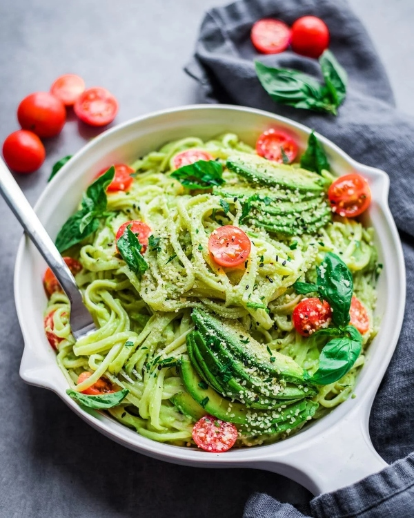

# Here you go, a yummy recipe for you!

## Creamy Avocado Pasta (Vegan)




### INGREDIENTS

```
🥑 200g Pasta
🥑 Fresh Basil
🥑 Fresh Parsley
🥑 1 Avocado
🥑 1 Chili
🥑 1 Garlic Clove
🥑 ½ Onion
🥑 2 tbsp Lemon Juice
🥑 ½ dl Olive Oil
🥑 ½ dl Nutritional Yeast
🥑 ¼ tsp Salt
```
Cook the pasta and meanwhile prepare the sauce.

Measure all the sauce ingredients into a blender. Run the blender on medium or high speed until smooth. Add water if necessary. You can also puree the avocado with a fork, chop the rest of the ingredients as small as possible with a knife and mix all the ingredients of the sauce together.

Serve immediately with pasta.

> **Tip**: Avocado pasta can be served with fried tofu, marinated chickpeas or other beans or warmed frozen peas.

**Gluten-free version**: Use gluten-free pasta.

### To find more information about avocados, click here --> [🥑](https://en.wikipedia.org/wiki/Avocado)
