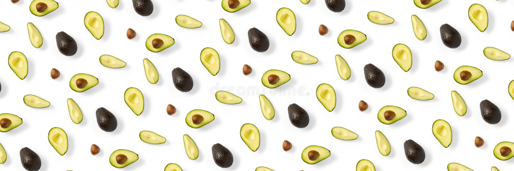

# Free choice extra task bundle E

### Basic website created with Markdown language and published on GitHub Pages.  

🥑 🥑 🥑 🥑 🥑 🥑 🥑 🥑 🥑 🥑 🥑 🥑 🥑 🥑 🥑 🥑 🥑 🥑 🥑 🥑 🥑 🥑 🥑 🥑 🥑 🥑 🥑 🥑 🥑 🥑 🥑 🥑 🥑 🥑 🥑 🥑

Course: Cloud Services

Autumn 2022

&nbsp;

 

## *Click the avocado!*

&nbsp;

### Task requirements
> 
> - Website must be public
> - Use at least handful of markdown markup features to format the web page
> - Document your work process with few screenshots to the learning diary
> - Write the Github page address to the learning diary so that your peer reviewers can verify it easily
> - Keep the pages available until you have received your course grade
>
>  

### See this page on **[GitHub](https://github.com/nennahanninen/markdown-website.git)** !
